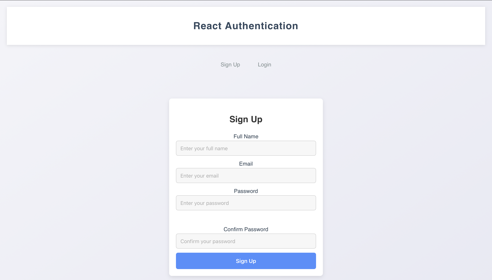
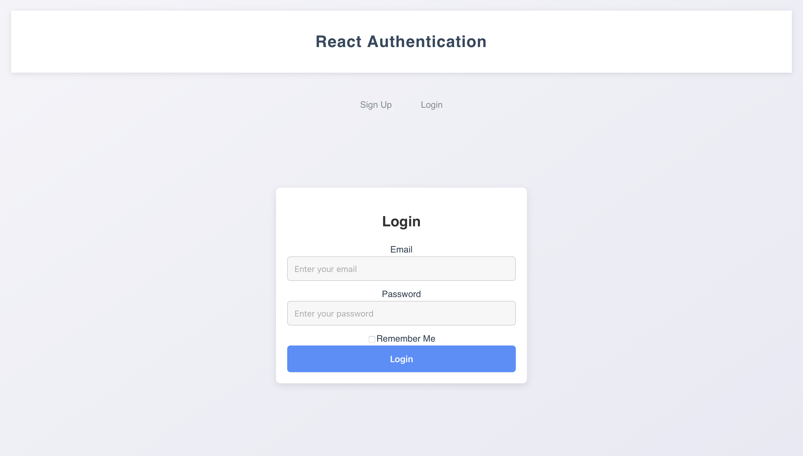

# Project Name: SignUp & Login Forms

## Description
This project features a simple yet responsive web-based sign-up and login form using React, styled with CSS for a minimalistic and modern design. It emphasizes user-friendly experiences, compact design, and responsiveness to ensure that the forms work seamlessly on both desktop and mobile screens. The sign-up form also includes a password strength indicator.

## Table of Contents
1. [How to Run the Project](#how-to-run-the-project)
2. [Design Choices](#design-choices)
3. [Assumptions and Limitations](#assumptions-and-limitations)

---
Here is a screenshot of the application:

SignUp Page:

Login Page:



## How to Run the Project

### Prerequisites
Before running the project, ensure you have the following installed:
- [Node.js](https://nodejs.org/) (v16 or higher)
- [npm](https://www.npmjs.com/) (Node package manager, comes with Node.js)

### Steps to Run

1. **Clone the repository**  
   Open your terminal and clone the project using Git:
   ```bash
   git clone https://github.com/yourusername/project-name.git
   cd project-name
   ```

2. **Install Dependencies**  
   Install the required dependencies using npm:
   ```bash
   npm install
   ```

3. **Start the Development Server**  
   After the installation is complete, start the development server:
   ```bash
   npm start
   ```

4. **Open in Browser**  
   Open your browser and go to [http://localhost:3000](http://localhost:3000) to view the application.

---

## Design Choices

### 1. **Form Layout**
   - **Compact and Centered**: The form container is centered on the page with a maximum width of 450px. It is designed to be compact while still allowing for legible text and form elements.
   - **Minimalistic Design**: The form uses simple colors (light background, subtle borders, and soft shadows) to ensure a clean and professional appearance.
   - **Input Fields**: The input fields are styled for a clean, modern look with a subtle focus effect that changes the border color to blue.
   - **Responsiveness**: The form is fully responsive, scaling down gracefully for smaller screens (mobile devices), with adjusted padding and font sizes.

### 2. **Password Strength Indicator**
   - The password strength indicator provides feedback to the user as they type, displaying different strength levels (weak, medium, strong) based on the password entered.

### 3. **Colors and Typography**
   - **Primary Color**: #4d90fe (Light Blue) used for the submit button, input focus border, and password strength indicator to create an inviting, trustworthy feel.
   - **Background**: White background with subtle shadows to give the form a floating, card-like appearance.
   - **Font**: A clean sans-serif font is used to ensure legibility.

---

## Assumptions and Limitations

### Assumptions
- **Browser Support**: The project assumes modern browsers are being used, such as the latest versions of Chrome, Firefox, Safari, or Edge.
- **No Backend Integration**: This project currently does not include backend integration. The form submission behavior is limited to storing values in `localStorage` for demo purposes.
- **No Email Validation**: The form performs basic client-side validation but does not integrate with any real-world email verification system.
- **Responsive Design**: It is assumed that the majority of users will access the app from either desktop or mobile devices. The design scales well on most screen sizes (down to mobile screen widths of 480px).

### Limitations
- **LocalStorage for Demo**: The project uses `localStorage` to store the email and password for demonstration purposes. This does not provide actual authentication or persistence.
- **Lack of Backend**: As a static front-end form, the app does not communicate with a backend system to verify credentials or store user data. It is meant to be used as a demonstration or prototype for further backend development.
- **Validation Limits**: While the sign-up form includes basic validation for email format and password strength, it does not verify whether the email is already in use or implement password rules beyond a strength indicator.

---

## Future Improvements
- Integrating backend authentication for real sign-up/login functionality.
- Storing user data in a real database.
- Adding a password recovery/reset functionality.
- Implementing a more advanced form validation system for fields like email, password, and confirmation.

---

## License
This project is licensed under the MIT License - see the [LICENSE](LICENSE) file for details.

```

### Key Sections in the README:

1. **How to Run the Project**: Explains the steps to clone the repo, install dependencies, and run the project.
2. **Design Choices**: Details the layout, styling decisions, and features like the password strength indicator and responsive design.
3. **Assumptions and Limitations**: Clarifies assumptions about the environment (browser support, localStorage usage, etc.) and lists any limitations (lack of backend integration, limited validation).
4. **Future Improvements**: Mentions potential future features and enhancements, such as backend integration or more advanced validation.

Feel free to adjust and customize this as needed for your project!
